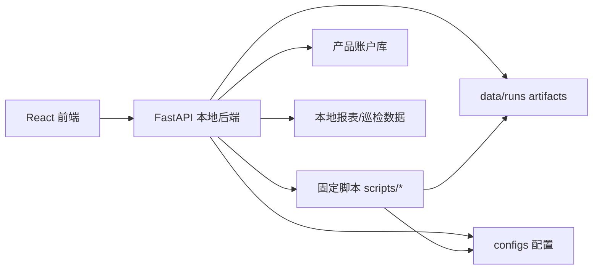

# FastAPI + React 全量替换 Streamlit 设计

日期：2026-05-27  
状态：待评审  
目标：并行建设新的 FastAPI + React 本地管理系统，覆盖现有 Streamlit 页面能力；验收完成前保留 Streamlit 作为回退入口，验收完成后再封存或删除。

## 背景

现有 Streamlit 面板已经承担了创建计划、项目管理、落地页管理、账户备注、任务中心、操作日志和结果查看等入口。但 Streamlit 的执行模型会在 checkbox、button、输入框变化后整页重跑，导致真实执行卡片丢失、错误卡片抢占位置、状态串扰和重复 widget key 等问题。对“删除项目”“修改账户备注”“真实创建”等高风险操作，这种状态不可控会直接影响安全感和操作效率。

新系统不重写业务脚本，不直接替代现有 OpenAPI 调用层。迁移重点是替换交互层、状态管理、中文摘要、任务编排和数据看板。

## 目标

1. 用 React + TypeScript 替换 Streamlit 前端，解决页面状态不可控问题。
2. 用 FastAPI 提供本地后端 API，统一封装配置生成、固定脚本执行、任务状态、artifact 读取和中文摘要。
3. 保留固定脚本作为唯一真实业务执行入口，React 和 FastAPI 都不直接拼平台业务接口。
4. 所有 JSON 都必须先展示中文摘要和明细表，原始 JSON 只作为折叠技术细节和留档。
5. 真实执行统一走“中文摘要核对 -> 输入确认 -> 后端启动任务 -> 任务中心跟踪 -> 结果中心复盘”。
6. 新增产品账户库，支持 Excel / CSV 上传和多行粘贴，维护账户与产品归属关系。
7. 新增完整数据看板，默认按产品视角展示经营和投放表现，并能下钻到账户、项目、素材和建议。

## 非目标

1. 第一版不做在线深度编辑完整创建模板。
2. 第一版不做拖拽式 BI 或任意自定义报表搭建器。
3. 第一版不改写现有固定脚本的业务语义。
4. 第一版不删除 Streamlit，验收通过后再处理。
5. React 前端不保存 token、cookie、平台密钥等敏感信息。

## 技术栈

后端：
- Python 3.11
- FastAPI
- Pydantic
- Uvicorn
- 现有 `src/roibang_v2` workflow、artifact、task、operation log 能力

前端：
- React
- TypeScript
- Vite
- Ant Design
- React Router
- TanStack Query
- ECharts 或 Ant Design Charts

存储：
- `data/runs/`：继续存任务、运行结果、操作日志、同步数据。
- `configs/`：继续存业务配置。
- `data/local/` 或 `configs/accounts/`：存产品账户库。第一版优先使用 JSON 文件，后续数据量扩大再迁移 SQLite。

## 总体架构



关键边界：
- React 只调用 FastAPI。
- FastAPI 只负责本地编排和固定脚本调用。
- 真实业务动作必须通过现有固定脚本执行。
- 所有执行过程写入 task artifact 和 operation log。

## 页面模块

### 1. 首页数据看板

默认按产品聚合展示：
- 今日消耗
- 今日计费时间转化数
- 计费时间转化成本
- 计费当日付费 ROI
- 活跃账户数
- 活跃项目数
- 异常项目数
- 建议处理事项数

筛选：
- 日期：今天、昨天、近 3 天、近 7 天、近 30 天、自定义
- 产品
- 渠道
- 负责人
- 账户状态
- 账户 ID / 账户名

### 2. 产品账户库

功能：
- Excel / CSV 上传
- 多行文本粘贴
- 字段校验
- 重复账户识别
- 新增 / 更新 / 跳过预览
- 按产品、渠道、负责人、状态筛选
- 导出账户库

字段：
- `product_key`
- `product_name`
- `advertiser_id`
- `advertiser_name`
- `channel`
- `owner`
- `account_remark`
- `status`
- `notes`

状态枚举：
- `active`：可用于创建和日常管理
- `paused`：暂不用于创建，但可查看数据
- `disabled`：默认隐藏，不参与创建

### 3. 产品看板

回答“这个产品现在跑得怎么样”：
- 消耗、转化、成本、ROI 趋势
- 产品账户排行
- 产品项目排行
- 素材表现
- 最近创建效果
- 最近操作记录

### 4. 账户看板

回答“这个账户有没有问题”：
- 今日、昨日、近 7 天数据
- 项目列表
- 单元列表
- 素材列表
- 落地页 / 小游戏资产
- 最近操作日志
- 异常提示

### 5. 项目看板

字段：
- 产品
- 账户
- 项目 ID
- 项目名
- 状态
- 创建时间
- 消耗
- 转化数
- 转化成本
- ROI
- 出价
- 预算
- 当前建议
- 最近操作

项目表格里的操作不直接真实执行，只跳转到项目管理生成配置。

### 6. 素材看板

第一版字段：
- 素材 ID
- 素材类型
- 所属产品
- 使用账户数
- 使用项目数
- 消耗
- 转化
- 成本
- ROI
- 最近使用时间
- 是否高频重复
- 是否低效

视频预览和标签分析作为后续增强。

### 7. 创建计划

第一版做受控创建主链路：
- 选择产品
- 按产品账户库选择账户
- 生成创建计划
- 展示中文摘要
- 展示素材、文案、CTA、卖点分配
- 执行前审查
- 输入 `确认执行`
- 启动真实创建固定脚本
- 任务中心跟踪
- 结果中心复盘

不做完整模板在线编辑器。

### 8. 项目管理

动作：
- 删除项目
- 开启项目
- 关闭项目
- 调预算
- 调出价
- 调 ROI

流程：
- 选择产品或账户
- 设置筛选规则
- 生成项目管理配置
- 展示中文摘要和项目明细
- 输入 `确认执行`
- 启动固定脚本
- 任务中心跟踪

### 9. 落地页管理

动作：
- 删除橙子建站落地页
- 查看转赠结果
- 模板建站结果查看
- 后续补充本地落地页创建流程

落地页更新禁止走不安全的全量 `site/update` 入口，默认使用模板建站或状态更新等固定安全入口。

### 10. 账户备注

流程：
- 按产品筛账户
- 生成账户备注配置
- 展示账户明细和目标备注
- 输入 `确认执行`
- 启动固定脚本
- 任务中心跟踪

### 11. 异常与建议中心

读取巡检建议和本地报表数据，按优先级展示：
- 建议删除项目
- 建议关闭项目
- 建议下调预算
- 建议下调出价
- 建议观察
- 好项目 / 好素材

每条建议必须有中文解释，例如：
> 近 3 天消耗 328 元，计费转化 0，已运行 6 天，建议删除。

可执行动作：
- 生成删除项目配置
- 生成暂停项目配置
- 生成调预算配置
- 忽略本次建议

### 12. 任务中心

展示：
- 任务 ID
- 操作类型
- 状态
- 开始时间
- 结束时间
- 退出码
- stdout
- stderr
- 结果 artifact
- 中文摘要

任务启动后页面刷新不丢状态。

### 13. 操作日志

展示所有前端触发过的动作：
- 谁触发
- 什么时候
- 什么模块
- 输入摘要
- 结果摘要
- 关联任务
- 关联 artifact

### 14. 结果中心

按 workflow 查看最近结果：
- 创建计划
- 创建执行
- 项目管理执行
- 落地页管理
- 账户备注
- 投放巡检
- 巡检建议
- 定时任务状态

默认中文摘要优先，原始 JSON 折叠展示。

### 15. 系统设置

第一版只做本地配置查看：
- runs_dir
- configs 路径
- 固定脚本路径
- token 健康检查入口
- 数据同步入口

## FastAPI API 设计

路径前缀：`/api`

### 系统

- `GET /api/health`
- `GET /api/settings`
- `GET /api/workflows/latest?workflow=...`

### 账户库

- `GET /api/accounts`
- `POST /api/accounts/import/preview`
- `POST /api/accounts/import/commit`
- `POST /api/accounts/paste/preview`
- `POST /api/accounts/paste/commit`
- `GET /api/accounts/export`

### 数据看板

- `GET /api/dashboard/overview`
- `GET /api/dashboard/products`
- `GET /api/dashboard/products/{product_key}`
- `GET /api/dashboard/accounts/{advertiser_id}`
- `GET /api/dashboard/projects`
- `GET /api/dashboard/materials`
- `GET /api/dashboard/suggestions`

### 创建计划

- `POST /api/create-plans/preview`
- `POST /api/create-plans/generate`
- `GET /api/create-plans/{plan_id}`
- `POST /api/create-plans/{plan_id}/execute/preview`
- `POST /api/create-plans/{plan_id}/execute`

### 项目管理

- `POST /api/project-management/config/preview`
- `POST /api/project-management/config/generate`
- `POST /api/project-management/execute/preview`
- `POST /api/project-management/execute`

### 落地页管理

- `POST /api/sites/status/preview`
- `POST /api/sites/status/execute`
- `GET /api/sites/handsel-results`
- `POST /api/sites/template-foundation/preview`
- `POST /api/sites/template-foundation/execute`

### 账户备注

- `POST /api/account-remarks/config/preview`
- `POST /api/account-remarks/config/generate`
- `POST /api/account-remarks/execute/preview`
- `POST /api/account-remarks/execute`

### 任务与日志

- `GET /api/tasks`
- `GET /api/tasks/{task_id}`
- `GET /api/tasks/{task_id}/stdout`
- `GET /api/tasks/{task_id}/stderr`
- `GET /api/operation-logs`
- `GET /api/operation-logs/{operation_id}`

## 中文摘要规范

所有后端返回给前端的业务结果都包含：

```json
{
  "summary": {
    "title": "删除项目预览",
    "status": "planned",
    "risk_level": "high",
    "execution_enabled": false,
    "items": [
      {"label": "产品", "value": "点点英雄"},
      {"label": "账户数", "value": 12},
      {"label": "项目数", "value": 38}
    ],
    "warnings": [],
    "blocking_reasons": []
  },
  "table": {
    "columns": ["产品", "账户 ID", "项目 ID", "项目名", "消耗", "建议原因"],
    "rows": []
  },
  "artifact_path": "",
  "raw": {}
}
```

前端默认渲染 `summary` 和 `table`，原始 JSON 只折叠展示。

## 真实执行确认规范

所有真实执行业务动作必须满足：
1. 后端返回执行前中文摘要。
2. 前端展示完整明细表。
3. 用户输入 `确认执行`。
4. 后端启动固定脚本，脚本命令必须来自 allowlist builder，不接受前端传任意 shell。
5. 任务写入 `data/runs/frontend_tasks/`。
6. 执行结果写入对应 workflow artifact。
7. 操作日志记录 request、summary、task_id、artifact_path。

## 数据来源

第一版数据看板读取：
- 本地报表同步结果
- `data/runs/delivery_patrol*`
- `data/runs/project_update_execute*`
- `data/runs/create_live_execute_once*`
- `data/runs/frontend_operation_log*`
- 产品账户库
- 素材库同步结果

必要时通过固定数据同步脚本刷新，不由 React 直接访问平台 API。

## 文件结构

新增：

```text
backend/
  app/
    main.py
    api/
    services/
    schemas/
    script_registry.py
    summary_builder.py
  tests/

frontend/
  package.json
  vite.config.ts
  src/
    app/
    pages/
    components/
    api/
    types/
    charts/

configs/accounts/
  product-accounts.local.json
```

保留：

```text
app/streamlit_app.py
scripts/run_streamlit_ui.py
scripts/restart_streamlit_ui.py
```

Streamlit 在验收完成前不删除，只不再作为主入口。

## 开发排期

### 第 0 阶段：设计确认

时间：2026-05-28 至 2026-05-29

产出：
- 本设计文档
- 实施计划
- 验收清单

### 第 1 周：基础框架

时间：2026-06-01 至 2026-06-05

产出：
- FastAPI 基础服务
- React 基础壳
- 路由、布局、任务中心基础
- artifact 读取和中文摘要组件
- 固定脚本执行封装

验收：
- React 页面能打开
- 能查看最近 artifact 中文摘要
- 能启动 dry-run 固定脚本
- 不依赖 Streamlit

### 第 2 周：账户归属库 + 数据基础

时间：2026-06-08 至 2026-06-12

产出：
- 账户库上传和粘贴导入
- 账户归属查询
- 产品、渠道、负责人筛选
- 报表数据读取接口

验收：
- 能上传账户归属表
- 能按产品查看账户
- 能导出账户库
- 导入前后都有中文摘要

### 第 3 周：数据看板第一版

时间：2026-06-15 至 2026-06-19

产出：
- 首页总览
- 产品看板
- 账户看板
- 项目看板
- 基础素材看板
- 异常与建议中心

验收：
- 默认按产品看数据
- 支持常用日期范围
- 能从产品下钻到账户、项目
- 异常项目有中文原因

### 第 4 周：高风险执行模块

时间：2026-06-22 至 2026-06-26

产出：
- 项目管理
- 落地页管理
- 账户备注
- 统一执行确认组件
- 任务中心执行跟踪

验收：
- 删除项目不会串到账户备注
- 所有真实执行前不用读 JSON
- 执行结果可复盘

### 第 5 周：创建计划主链路

时间：2026-06-29 至 2026-07-03

产出：
- 产品账户选择
- 创建计划生成
- 创建计划审查
- 素材、文案、CTA、卖点展示
- 真实创建执行

验收：
- 能从产品账户库发起创建
- 能看清楚每个账户创建什么
- 能真实执行创建固定脚本
- 失败能看到中文原因

### 第 6 周：联调、验收、切换

时间：2026-07-06 至 2026-07-10

产出：
- 全链路回归
- 错误状态和空状态
- 操作日志补齐
- 使用文档
- Streamlit 标记为旧版

验收：
- 日常操作不需要 Streamlit
- 数据看板可支撑日常判断
- 创建、删除、备注、落地页都走 React
- 所有 JSON 都有中文摘要
- 真实执行可追踪、可复盘

## 验收标准

1. 主要页面不依赖 Streamlit。
2. 产品账户库可导入、查询、筛选、导出。
3. 数据看板能按产品、账户、项目、素材查看核心指标。
4. 创建计划主链路可用。
5. 项目管理、落地页管理、账户备注可用。
6. 任务中心可查看执行状态、stdout、stderr、结果 artifact。
7. 操作日志可追溯每一次前端动作。
8. 所有 JSON 页面都有中文摘要优先展示。
9. 所有真实执行必须输入 `确认执行`。
10. React 和 FastAPI 不直接绕过固定脚本执行真实业务动作。

## 风险与控制

| 风险 | 控制 |
| --- | --- |
| 全量替换范围大 | 分阶段并行建设，Streamlit 验收前保留 |
| 真实执行误触 | 后端固定脚本 allowlist、统一确认组件、任务日志 |
| 数据口径不一致 | 看板统一读取本地同步结果和现有 artifact |
| 中文摘要遗漏 | 后端统一 summary builder，前端禁止裸 JSON 作为主展示 |
| 账户归属错误影响创建 | 导入预览、重复校验、active 状态过滤 |
| 前端复杂度增加 | React 只做页面和状态，业务逻辑留在后端服务和固定脚本 |

## 自审结果

- 无未决占位符。
- 架构边界与真实执行安全要求一致。
- 第一版范围覆盖全量替换，但复杂模板编辑和拖拽 BI 已明确排除。
- 账户上传方式和字段已按用户确认固定。
- 数据看板默认主视角为产品。
- Streamlit 保留至验收完成后再删除。
